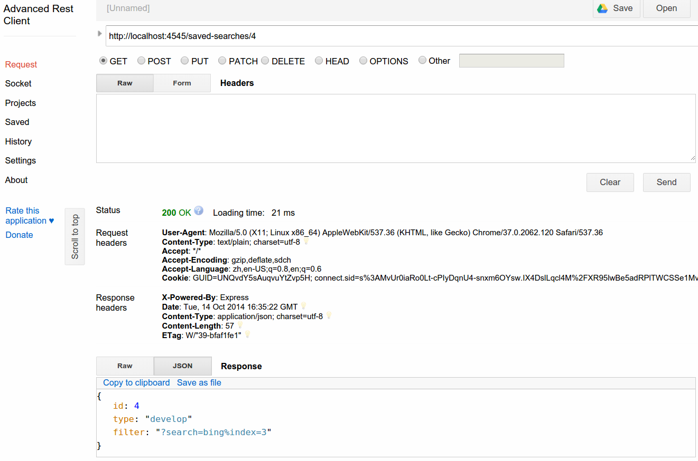
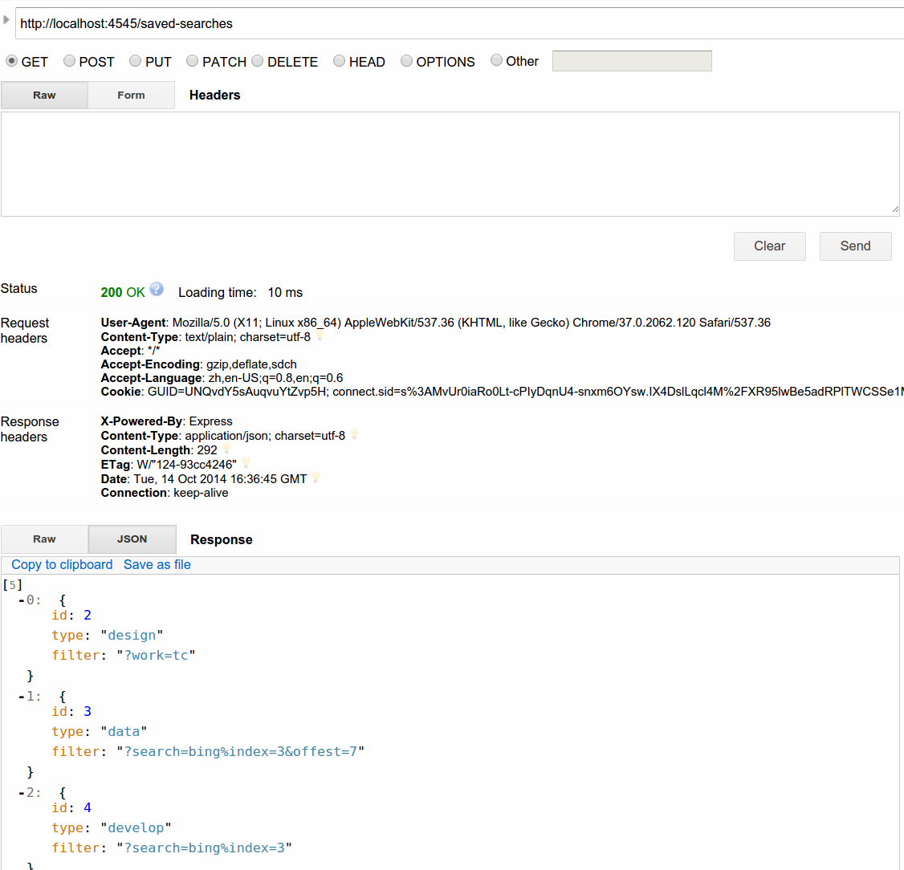
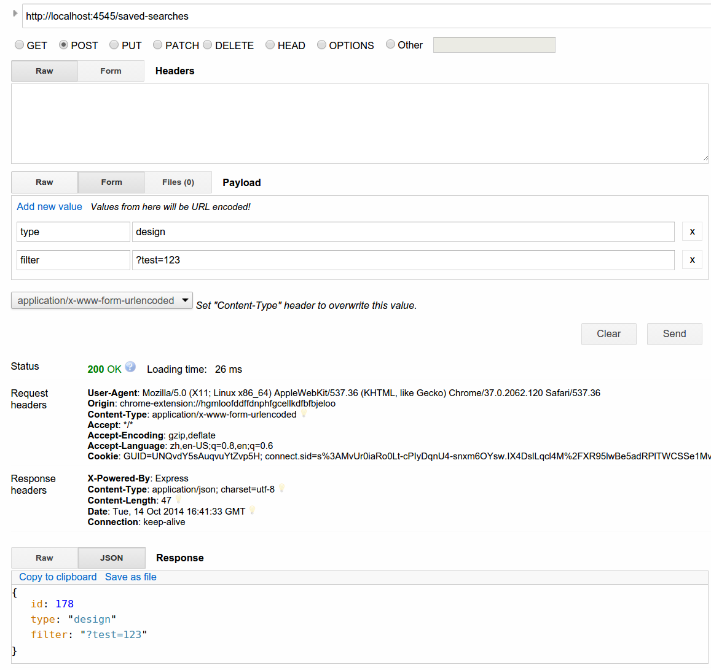
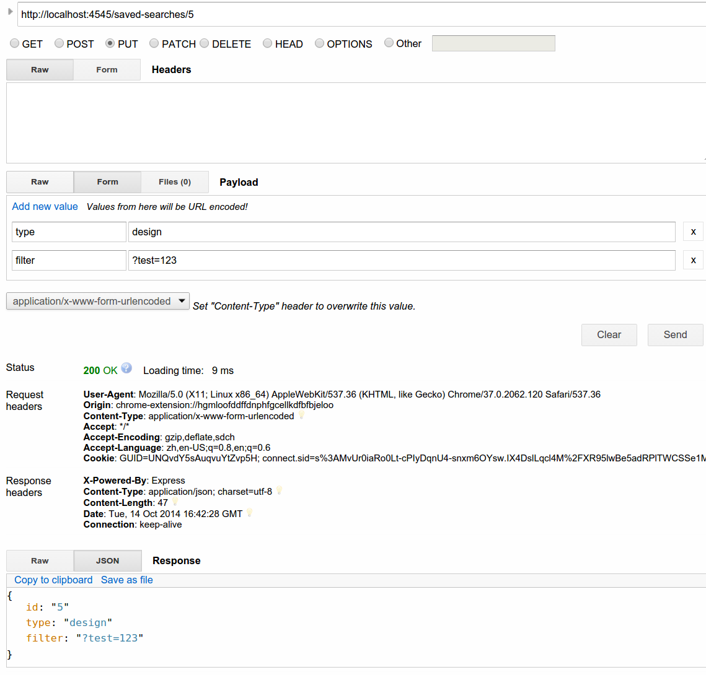
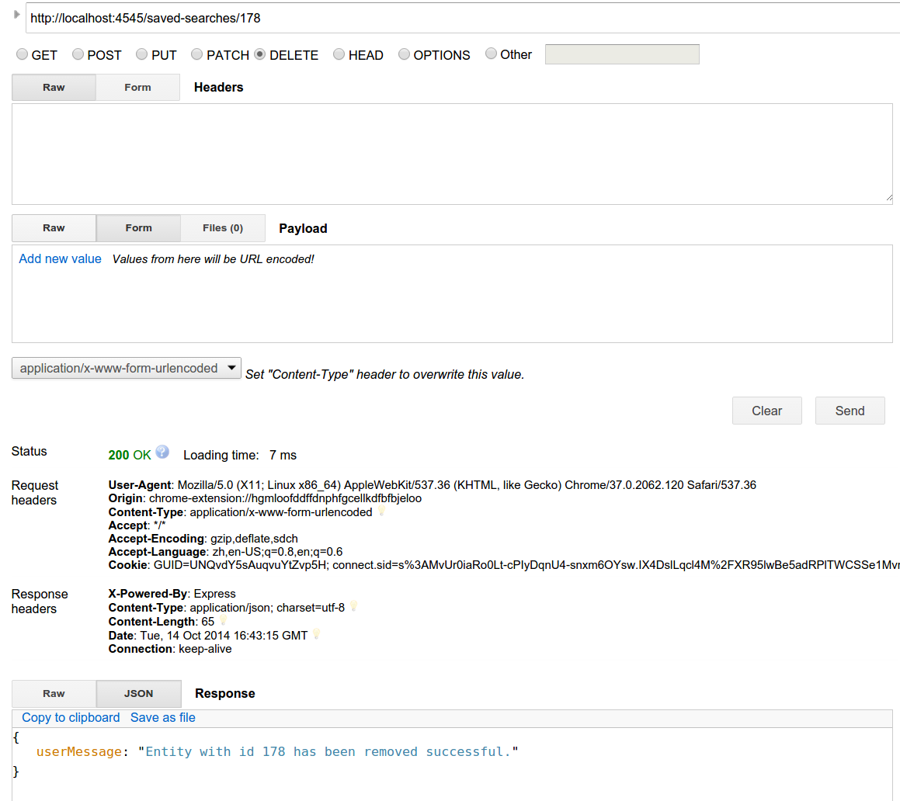

# PoC Assembly - Member Settings Service - Savable Search API

A micro service to store settings for users on topcoder.

## Getting Started

* Install: npm install
* Start Server: node server.js


## Testing

* Install: npm install -g grunt
* Start testing: grunt


## Organization

```
.
├── Gruntfile.js
├── js
│   ├── savableSearch.js
│   ├── saved-searches.js
│   ├── savedSetting.js
│   └── sequnce.js
├── log
│   ├── logger.log
│   └── requests.log
├── package.json
├── properties.js
├── readme.md
├── server.js
└── test
    ├── initialDB.js
    └── test-page.js
``

## Config file

**properties.js**
This file store the properties for this assembly

Property Name | Description | Example Setting
------------- | ----------- | -------------
DB_URL | Database URL | mongodb://localhost/test


## Verification

The db data is create in test/initial.js, you can call "grunt" to run test, then db has some test data.

### RESTful function

* start server first, then we can send request to verify functions.
  I use "Advanced Rest Client" in Chrome.

* Let's send a request to localhost/saved-searches/:id to get one item:
  

* Like Get method, we can get all items by visiting localhost/saved-searches
  

* We can send data to /saved-searches to create item
  

* Sending data to /saved-searches/:id can update one item
  

* Deleting one item by visiting /saved-searches/:id
  
