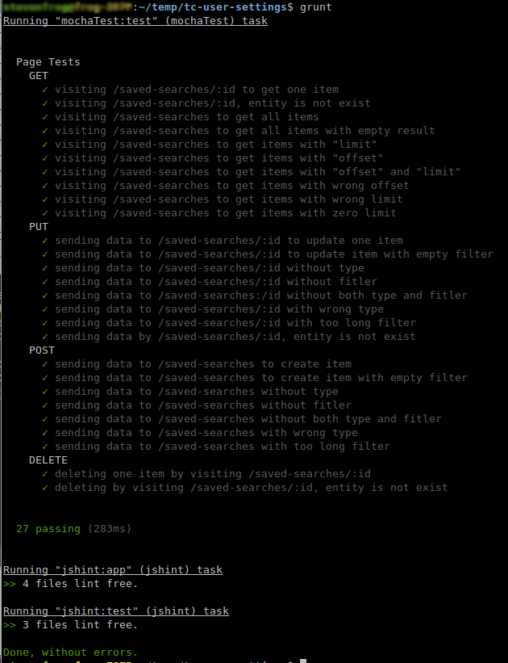

# PoC Assembly - Member Settings Service - Savable Search API

A micro service to store settings for users on topcoder.


## Getting Started

* Install: npm install
* Start Server: node server.js


## Start Testing

* Install: npm install -g grunt
* Start testing: grunt


## Organization

```
.
├── doc
│   ├── Deployment_Guide.odt
│   └── Deployment_Guide.pdf
├── Gruntfile.js
├── img
│   ├── create.png
│   ├── delete.png
│   ├── getall.png
│   ├── get.png
│   ├── test.png
│   └── update.png
├── js
│   ├── savableSearch.js
│   ├── saved-searches.js
│   └── sequnce.js
├── log
│   ├── logger.log
│   └── requests.log
├── package.json
├── properties.js
├── readme.md
├── server.js
└── test
    ├── initialDB.js
    └── test-page.js

```


## Config file

**properties.js**

Property Name | Description | Example Setting
------------- | ---------- | -------------
DB_URL | Database URL | mongodb://localhost/test
HOST_PORT | host port | 4545


**grunt scrips**

Task Name | Description
------------- | ----------
mochaTest | Run mocha test
jshint | Use jshint to check each js file


## Verification

Tests will initial DB data automatically. Please note it will not clear data from DB after testing.
Because I want to use it for web verify later.


### Test

* Start server first, and then you can run "grunt mochaTest" to see tests result.
  


### RESTful function


* Then we can send request to verify functions.
  I use "Advanced Rest Client" in Chrome.


* Let's send a request to localhost/saved-searches/:id to get one item:
  


* Like Get method, we can get all items by visiting localhost/saved-searches
  


* We can send data to /saved-searches to create item
  


* Sending data to /saved-searches/:id can update one item
  


* Deleting one item by visiting /saved-searches/:id
  


